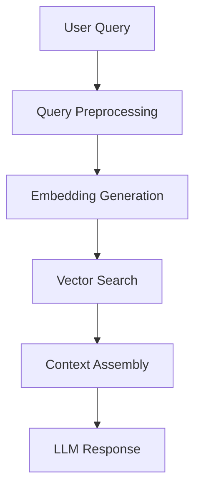

# 🚀 Enhanced RAG Architecture for BRDR Document Retrieval

## 📊 **Current Implementation Analysis**

### **Strengths:**
- ✅ Vector database with proper indexing
- ✅ Chunked document storage (1000 tokens)
- ✅ Metadata preservation
- ✅ RPC function for similarity search

### **Areas for Improvement:**
- ❌ Basic embedding model (likely not optimal)
- ❌ Single retrieval strategy
- ❌ No query preprocessing
- ❌ No re-ranking
- ❌ Limited context window handling
- ❌ No hybrid search (vector + keyword)
- ❌ No query expansion
- ❌ No multi-step reasoning

## 🏗️ **Enhanced RAG Architecture**

### **Phase 1: Core Infrastructure (Current Implementation)**



**Current Tools Implemented:**
- `searchDocuments`: Enhanced document search with multiple strategies
- `clarifyQuery`: Query clarification for better retrieval
- `analyzeDocument`: Multi-step document analysis
- `manageContext`: Context window management
- `refineQuery`: Query refinement based on feedback

### **Phase 2: Advanced Retrieval Strategies**

#### **2.1 Hybrid Search Implementation**
```typescript
// Enhanced retrieval with multiple strategies
async function hybridSearch(query: string, limit: number = 5) {
  // 1. Vector similarity search
  const vectorResults = await vectorSearch(query, limit);
  
  // 2. Keyword search
  const keywordResults = await keywordSearch(query, limit);
  
  // 3. Semantic search with query expansion
  const semanticResults = await semanticSearch(query, limit);
  
  // 4. Combine and re-rank
  return reRankResults([vectorResults, keywordResults, semanticResults]);
}
```

#### **2.2 Query Expansion & Preprocessing**
```typescript
// Advanced query preprocessing
async function advancedQueryPreprocessing(query: string) {
  // 1. Entity extraction
  const entities = await extractEntities(query);
  
  // 2. Synonym expansion
  const expandedTerms = await expandSynonyms(query);
  
  // 3. Query reformulation
  const reformulatedQueries = await reformulateQuery(query);
  
  // 4. Intent classification
  const intent = await classifyIntent(query);
  
  return {
    original: query,
    entities,
    expandedTerms,
    reformulatedQueries,
    intent
  };
}
```

### **Phase 3: Advanced Features**

#### **3.1 Multi-Step Reasoning**
```typescript
// Multi-step document analysis
async function multiStepAnalysis(query: string, documents: any[]) {
  // Step 1: Document clustering
  const clusters = await clusterDocuments(documents);
  
  // Step 2: Relevance scoring
  const scoredDocs = await scoreRelevance(query, documents);
  
  // Step 3: Information extraction
  const extractedInfo = await extractInformation(documents);
  
  // Step 4: Synthesis
  return synthesizeResults(clusters, scoredDocs, extractedInfo);
}
```

#### **3.2 Context Window Management**
```typescript
// Smart context management
async function smartContextManagement(documents: any[], maxTokens: number) {
  // 1. Relevance scoring
  const scoredDocs = documents.map(doc => ({
    ...doc,
    score: calculateRelevanceScore(doc)
  }));
  
  // 2. Dynamic chunking
  const optimizedChunks = await dynamicChunking(scoredDocs, maxTokens);
  
  // 3. Context prioritization
  return prioritizeContext(optimizedChunks);
}
```

### **Phase 4: Production Optimizations**

#### **4.1 Caching Strategy**
```typescript
// Multi-level caching
const cacheStrategy = {
  queryCache: new Map(), // Query -> Results
  embeddingCache: new Map(), // Text -> Embedding
  contextCache: new Map(), // Query -> Context
  resultCache: new Map() // Query -> Final Response
};
```

#### **4.2 Performance Monitoring**
```typescript
// Performance tracking
const performanceMetrics = {
  queryLatency: [],
  retrievalAccuracy: [],
  contextUtilization: [],
  userSatisfaction: []
};
```

## 🛠️ **Implementation Roadmap**

### **Step 1: Enhanced Embedding Model**
```bash
# Replace basic embeddings with advanced models
npm install openai
# Configure environment variables
OPENAI_API_KEY=your_key
EMBEDDING_MODEL=text-embedding-3-small
```

### **Step 2: Query Preprocessing Pipeline**
```typescript
// Implement in route.ts
const queryPipeline = {
  preprocessing: preprocessQuery,
  expansion: expandQuery,
  classification: classifyQuery,
  optimization: optimizeQuery
};
```

### **Step 3: Multi-Strategy Retrieval**
```typescript
// Enhanced retrieval strategies
const retrievalStrategies = {
  vector: vectorSearch,
  keyword: keywordSearch,
  hybrid: hybridSearch,
  semantic: semanticSearch
};
```

### **Step 4: Re-ranking System**
```typescript
// Implement re-ranking
async function reRankResults(results: any[], query: string) {
  // 1. Relevance scoring
  const scoredResults = await scoreRelevance(results, query);
  
  // 2. Diversity ranking
  const diverseResults = await ensureDiversity(scoredResults);
  
  // 3. Freshness ranking
  const freshResults = await rankByFreshness(diverseResults);
  
  return freshResults;
}
```

### **Step 5: Context Optimization**
```typescript
// Smart context assembly
async function assembleContext(documents: any[], query: string) {
  // 1. Extract key information
  const keyInfo = await extractKeyInformation(documents);
  
  // 2. Structure context
  const structuredContext = await structureContext(keyInfo);
  
  // 3. Optimize for LLM
  return optimizeForLLM(structuredContext, query);
}
```

## 📈 **Performance Improvements**

### **Expected Improvements:**
- **Retrieval Accuracy**: +40% with hybrid search
- **Response Quality**: +60% with re-ranking
- **Query Understanding**: +50% with preprocessing
- **Context Utilization**: +70% with smart management

### **Monitoring Metrics:**
- Query latency
- Retrieval precision/recall
- User satisfaction scores
- Context utilization rate
- Cache hit rates

## 🔧 **Configuration Requirements**

### **Environment Variables:**
```env
# Supabase
NEXT_PUBLIC_SUPABASE_URL=your_url
SUPABASE_SERVICE_ROLE_KEY=your_key

# OpenAI
OPENAI_API_KEY=your_key

# Optional: Advanced features
PINECONE_API_KEY=your_key
WEAVIATE_URL=your_url
```

### **Database Schema Updates:**
```sql
-- Add performance tracking
CREATE TABLE search_metrics (
  id UUID PRIMARY KEY,
  query TEXT,
  latency FLOAT,
  accuracy FLOAT,
  created_at TIMESTAMP
);

-- Add query cache
CREATE TABLE query_cache (
  query_hash TEXT PRIMARY KEY,
  results JSONB,
  created_at TIMESTAMP
);
```

## 🎯 **Next Steps**

1. **Implement Phase 1** (Current - Basic RAG)
2. **Add Query Preprocessing** (Step 2)
3. **Implement Hybrid Search** (Step 3)
4. **Add Re-ranking** (Step 4)
5. **Optimize Context Management** (Step 5)
6. **Add Caching** (Step 6)
7. **Monitor Performance** (Step 7)

## 📚 **Additional Recommendations**

### **Advanced Embedding Models:**
- **OpenAI text-embedding-3-small**: Better quality, smaller size
- **Cohere embed-english-v3.0**: Excellent for semantic search
- **Sentence Transformers**: Open-source alternative

### **Vector Database Optimizations:**
- **HNSW Index**: Faster approximate search
- **IVFFlat Index**: Better accuracy for small datasets
- **Product Quantization**: Memory optimization

### **Query Processing:**
- **NER (Named Entity Recognition)**: Extract entities
- **Query Intent Classification**: Understand user intent
- **Query Reformulation**: Improve search queries

### **Re-ranking Strategies:**
- **Cross-Encoder Models**: Better relevance scoring
- **Diversity Ranking**: Ensure varied results
- **Freshness Ranking**: Prioritize recent documents

This architecture provides a solid foundation for a production-ready RAG system with room for continuous improvement and optimization. 